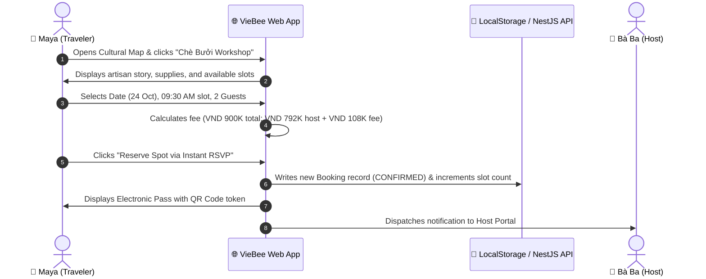
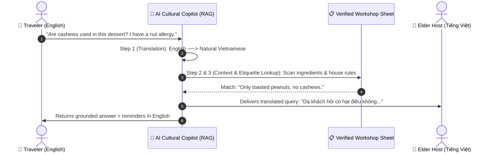
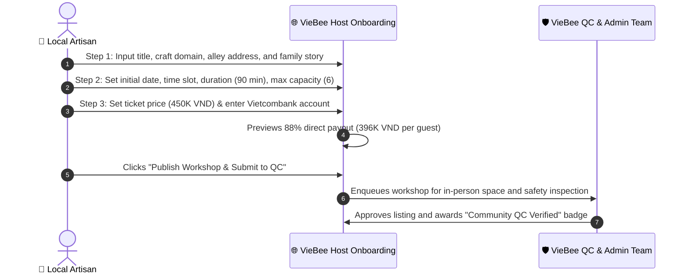

# 05 — Business Flows & Sequence Diagrams 🔄

## 1. Traveler Instant RSVP & Booking Flow

```mermaid
sequenceDiagram
    autonumber
    actor Traveler as 🎒 Maya (Traveler)
    participant Web as 🌐 VieBee Web App
    participant Storage as 💾 LocalStorage / NestJS API
    actor Host as 👵 Bà Ba (Host)

    Traveler->>Web: Opens Cultural Map & clicks "Chè Bưởi Workshop"
    Web->>Traveler: Displays artisan story, supplies, and available slots
    Traveler->>Web: Selects Date (24 Oct), 09:30 AM slot, 2 Guests
    Web->>Web: Calculates fee (VND 900K total: VND 792K host + VND 108K fee)
    Traveler->>Web: Clicks "Reserve Spot via Instant RSVP"
    Web->>Storage: Writes new Booking record (CONFIRMED) & increments slot count
    Web->>Traveler: Displays Electronic Pass with QR Code token
    Web->>Host: Dispatches notification to Host Portal
```

---

## 2. AI Cultural Copilot 4-Step Chain Flow

```mermaid
sequenceDiagram
    autonumber
    actor Traveler as 🎒 Traveler (English)
    participant Copilot as 🤖 AI Cultural Copilot (RAG)
    participant KB as 📋 Verified Workshop Sheet
    actor Host as 👵 Elder Host (Tiếng Việt)

    Traveler->>Copilot: "Are cashews used in this dessert? I have a nut allergy."
    Copilot->>Copilot: Step 1 (Translation): English ──> Natural Vietnamese
    Copilot->>KB: Step 2 & 3 (Context & Etiquette Lookup): Scan ingredients & house rules
    KB-->>Copilot: Match: "Only toasted peanuts, no cashews."
    Copilot->>Host: Delivers translated query: "Dạ khách hỏi có hạt điều không..."
    Copilot->>Traveler: Returns grounded answer + reminders in English
```

---

## 3. Host 3-Step Low-Friction Listing Flow

```mermaid
sequenceDiagram
    autonumber
    actor Host as 👵 Local Artisan
    participant Web as 🌐 VieBee Host Onboarding
    participant QC as 🛡️ VieBee QC & Admin Team

    Host->>Web: Step 1: Input title, craft domain, alley address, and family story
    Host->>Web: Step 2: Set initial date, time slot, duration (90 min), max capacity (6)
    Host->>Web: Step 3: Set ticket price (450K VND) & enter Vietcombank account
    Web->>Web: Previews 88% direct payout (396K VND per guest)
    Host->>Web: Clicks "Publish Workshop & Submit to QC"
    Web->>QC: Enqueues workshop for in-person space and safety inspection
    QC->>Web: Approves listing and awards "Community QC Verified" badge
```
